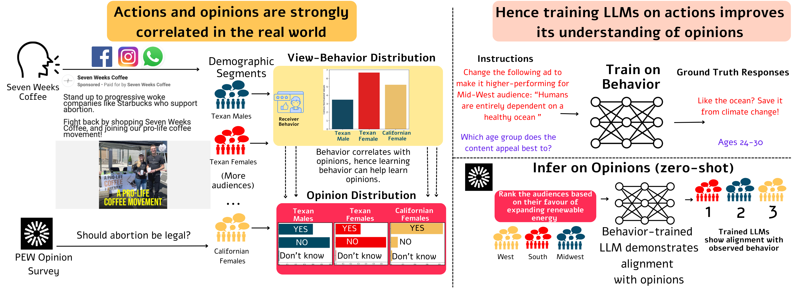

# Align Via Actions : Learning Behavior Aligns LLMs With Human Opinions in Zero-Shot

- [**Project Page**](https://behavior-in-the-wild.github.io/align-via-actions)
- [**Data (AVA50M)**](https://drive.google.com/drive/folders/1UlBbytEdGPTS5rIMAz-UZgdyO-2t4bht)
<!-- - [**Paper**](https://arxiv.org/abs/2309.00378) -->

<div align="center">
    
</div>

## Overview

This repository includes tools and datasets for evaluating Large Language Models (LLMs) on various behavioral tasks described in the paper and also run evaluations on the OpinionQA-XL dataset.

### Folders Description

#### Evaluation on OpinionQA-XL

The ```OQA-XL``` folder contains necessary files for evaluating LLMs on the OpinionQA-XL dataset. 

**About OpinionQA-XL:**
OpinionQA-XL significantly expands the original OpinionQA dataset to include PEW survey questions up to the final survey conducted in November 2022. The questions are extracted from survey PDFs using optical character recognition technology. Errors in extraction are corrected using GPT-4-turbo, followed by manual verification and correction. OpinionQA-XL introduces 68 new topics, such as Climate Change, Space Tourism, and Digital Economy, thereby greatly expanding the dataset's scope and relevance.


#### Evaluation on AlignViaActions50M

The ```eval_train_tasks``` provides scripts to evaluate LLMs on validation split of the AlignViaActions50M dataset proposed in the associated work. It contains a script to generate LLM responses, and two scripts to evaluate the generated responses on either predictive or generative tasks, as described in the paper.

The dataset can be downloaded from [This Google Drive Link](https://drive.google.com/drive/folders/1UlBbytEdGPTS5rIMAz-UZgdyO-2t4bht)


#### Zero-Shot Evaluation on Opinion and Culture Benchmarks

| Model (zero-shot)                  | OpinionQA-XL           |           | OpinionQA             |           | GlobalOpinionQA    |        | CultureBank        |            | CultureNLI    |          |
|------------------------------------|------------------------|-----------|-----------------------|-----------|--------------------|--------|--------------------|------------|---------------|----------|
|                                    | Representativeness (↑) | Steerability (↑) | Representativeness (↑) | Steerability (↑) | Avg Sim (↑) | Skew (↓) | Reddit (↑) | TikTok (↑) | US (↑) | IN (↑) |
| Llama-2-7B-chat                    | 83.61                  | 79.09     | 86.18                 | 79.18     | 83.6               | 2.2    | 85.93              | 92.08      | 39.2          | 39.5     |
| Mistral-7B-Instruct                | 82.56                  | 80.10     | 84.69                 | 80.37     | 79.3               | 3.2    | 70.02              | 67.23      | 42.5          | 43.8     |
| Vicuna-7B-v1.5                     | 72.26                  | 77.55     | 77.63                 | 77.68     | 84.94              | 1.92   | 64.88              | 55.02      | 55.72         | 56.15    |
| Llama-2-7B-SFT-CultureBank         | 82.70                  | 78.46     | 84.94                 | 78.55     | 85.4               | 1.5    | 85.93              | 92.08      | 39.2          | 39.6     |
| **Behavior Finetuned LLaMa-2-7B-chat** | **85.15**           | **81.95** | **88.43**             | **81.98** | **86.69**          | **1.43**| **92.39**          | **95.87**  | **47.14**     | **43.92**|
| LLaMa-2-13B-base                   | 80.45                  | 79.03     | 83.03                 | 79.14     | 83.13              | 1.45   | 73.19              | 89.02      | 53.34         | 49.48    |
| Llama-2-13B-chat                   | 81.18                  | 81.11     | 84.29                 | 81.35     | 84.03              | 1.96   | 86.17              | 92.34      | 60.08         | 61.73    |
| Vicuna-13B                         | 79.06                  | 78.73     | 83.44                 | 78.85     | 86.99              | 1.91   | 85.93              | 92.08      | 52.07         | 40.23    |
| **Behavior Finetuned LLaMa-2-13B-chat** | **85.76**           | **83.54** | **89.44**             | **83.53** | **87.31**          | **1.49**| **86.28**          | **92.25**  | **62.26**     | **66.44**|
| Mixtral-8x7B-Instruct              | 84.96                  | 82.31     | 88.39                 | 82.25     | 79.5               | 2.7    | 87.35              | 88.59      | 59.90         | 60.80    |
| Mixtral-8X7B-SFT-CultureBank       | 84.40                  | 79.66     | 78.69                 | 79.67     | 81.80              | 2.80   | 86.19              | 92.08      | 61.50         | 61.30    |
| Mixtral-8x7B-DPO-CultureBank       | 82.70                  | 80.22     | 78.79                 | 80.90     | 80.50              | 2.60   | 86.19              | 91.74      | 56.30         | 55.40    |
| Llama-2-70B-chat                   | 85.08                  | 82.40     | 88.83                 | 82.28     | 83.6               | 2.2    | 87.17              | 92.76      | 69.70         | 68.90    |
| **Behavior Finetuned LLaMa-2-70B-chat** | **86.65**           | **83.23** | **89.95**             | **83.31** | **86.31**          | **1.67**| **88.48**          | **92.65**  | **73.87**     | **73.67**|


### Citation

If you find this work useful for your research, please cite the it as follows:

```bibtex
@online{bhattacharyya2024align,
  title={Align Via Actions : Learning Behavior Aligns LLMs With Human Opinions in Zero-Shot},
  author={Bhattacharyya, Aanisha and Agrawal, Susmit and Singla, Yaman K and SR, Nikitha and Menta, Tarun Ram and Krishnamurthy, Balaji},
  year={2024},
  url={https://behavior-in-the-wild.github.io/align-via-actions}
}
```
